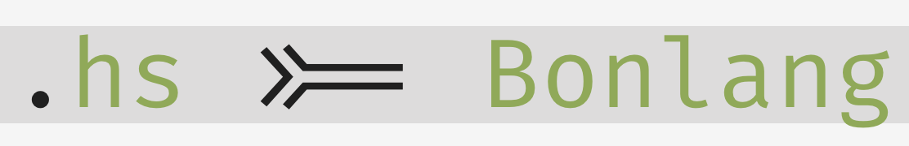

README
======



## Introduction

It's a programming language! A minimalist programming language.

I wrote (most) this during the ZuriHac 2016 weekend, and **it's still a work in
progress.**

## First steps

Head over to the [examples](test/examples/) folder for some good stuff.
Basically, your basic `hello-world` looks like this:

```
/*
 * file: main.bl
 *
 * This is where I tell you things
 */

module Main where

def main [] = {
    print $ "Hello World!";
}
```

You need to always have a `Main` module with a `main` method defined. This
is what the runtime looks for in order to start the program.

## Other examples

### Lazy evaluation

The language is lazy, so this yields "Lazy Hello" but not "Hello World"

```
module Main where

def main [] = {
    val sayHello = puts-ln $ "Hello World!";
    puts-ln $ "Lazy Hello!";
}
```

Those curly braces indicate "Instruction blocks". The runtime will try go
through semicolon-separated expressions, reducing where necessary.

So this **will** produce output

```
module Main where

def main [] = {
    val print' = print $ "Hello World!";
    print'; // Needs evaluation to happen
}
```

### Automatic currying

The language supports automatic currying:

```
module Main where

/**
 * Adds two values
 */
def addValues [x, y] = + $ x y

def main [] = {
    val add2 = addValues $ 2;
    val four = add2 $ 2;

    // Will output '4'
    puts-ln $ four;
}
```

Or using higher order functions with curried functions

```
module Main where


def main [] = {
    val addFive    = + $ 5;
    val printArray = map $ puts-ln;

    printArray $ (map $ addFive [0, 5, 10, 15]);
}
```

### Function application

Function application is done with the `$` operator after an expression. If
the expression is a function, it will be applied. The runtime will throw an
error otherwise.

You should be familiar with Polish notation.

### Lambda support

The language supports lambdas (closures)

```
module Main where

/**
 * Will output '4' twice in new lines
 */
def main [] = {
    val λ1 = lambda [x, y] => + $ x y;
    val λ2 = lambda [y] => λ1 $ 2 y;

    puts-ln $ (λ1 $ 2 2);
    puts-ln $ (λ2 $ 2);
}
```

It also supports simple pattern matching on scalars and lists

```
def is-zero [num] =
  match num {
    0 -> true;
    _ -> false;
  }
```

Will only return `true` for `is-zero $ 0`

```
def is-single-element [list] =
  match list {
    [_] -> true;
    _   -> false;
  }
```

Will only return true for lists with one item, of whatever type and value.

A more advanced usage example would be

Checking a static prefix:
```
def list-starts-with-one? [list] =
  match list {
    [ 1 | _ ] -> true;
    _         -> false;
  }
```

Will return true for lists like
`[1], [1, 2], [1, 2, 3], [1, "a"], [1, 4], [1,-1]`, but never for lists that
don't start with a `1`.


Or

```
def list-has-one-a-wildcard-and-three? [list] =
  match list {
    [ 1, _, 3 | _ ] -> true;
    _               -> false;
  }
```

Will return true for a list like `[1, 3, 3]` or `[1, -1, 3, 4, 5]`.

And of course some classic examples using pattern matching

```
// Gets first element of a given list
// Example: (list-head $ [1, 2, 3]) => 1
def list-head [list] =
  match list {
    []        -> error $ "Empty list";
    [ x | _ ] -> x;
  }

// Discards the first element of a list and returns the rest
// Example: (list-tail $ [1, 2, 3]) => [2, 3]
def list-tail [list] =
  match list {
    []         -> error $ "Empty list";
    [ _ | xs ] -> xs;
  }

// Reverses a list
// Example: (list-reverse $ [1, 2, 3, 4]) => [4, 3, 2, 1]
def list-reverse [list] =
  match list {
    []         -> [];
    [ x | xs ] -> concat-lists $ (list-reverse $ xs) [x];
  }

// Gets a list of successive pairs for a given list
// Example: (list-to-pairs $ [1, 2, 3, 4]) => [[1, 2], [3, 4]]
def list-to-pairs [list] =
  match list {
    []            -> [];
    [_]           -> error $ "Uneven number of elements!";
    [ x, y | xs ] -> concat-lists $ [[x, y]] (list-to-pairs $ xs);
  }
```

## Motivations

This is developed in Haskell, I wanted to
test [`stack`](https://docs.haskellstack.org/en/stable/README/)
and [`parsec`](https://hackage.haskell.org/package/parsec),
and that eventually turned into this.

I first read (and actually this contains code from)
[Write Yourself a Scheme in 48 Hours](https://en.wikibooks.org/wiki/Write_Yourself_a_Scheme_in_48_Hours).
That prompted me to design this. It has elements from Haskell, Scala, and Lisp.

It's fun.

## Brought to you by

Carlos D'Agostino.

You can visit my blog here https://cdagostino.io

[Disclaimer](doc/images/noidea.png).

[About my fixation with the number 4](https://xkcd.com/221/).

## LICENSE

See [LICENSE](LICENSE) file in this repo.

## TODOS

See [TODO](TODO.md) file in this repo.
